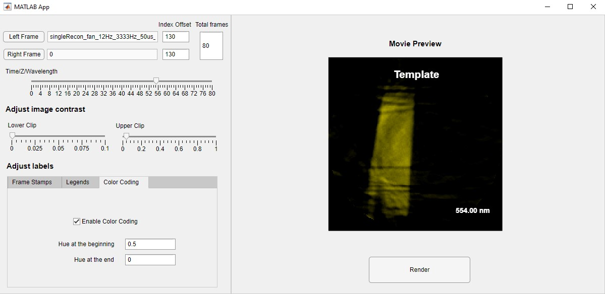

# Simple Video Generators
Matlab apps to generate simple videos for imaging research articles. 

## Generate Movie Pair

### Function
Tile two movie side by side or place single movie. Add frame stamps (frame-dependent labels) and legends (static labels) (as many as we want). Add color coding to frame. 

Can be used for __hyperspectral imaging data__, __time imaging data__, __z scanning data__ visualization. 

####  Time lapse data

####  Hyperspectral data

### Installation
** __Requires MATLAB 2020 or higher__ ** 

Open Matlab and double click the __GenerateMoviePair.mlappinstall__ file. The app will be added to the _APPS_ Tab in Matlab. 

### Usage
1. Select one/two movies (tif or tiff stack file) by clicking buttons __Left Frame__ and __Right Frame__; If using only one movie, just leave one of the entries empty.
2. Choose __Index Offset__ and __Total frames__;
3. Add time stamps and legends (if applicable) by clicking button __Add__ beside their corresponding menu; Check color coding if applicable. 
4. Preview by draging the __Time__ slider;
5. Click on button __Render__. The movie will be saved in current folder. 

### Options
- Index Offset: The preview frame index will be the frame index in __Time__ slider added by this __Index Offset__.
- Total frames: The total number of frames to be previewed and rendered.
- Adjust image contrast: Adjust __Lower Clip__ and __Upper Clip__ to clip the lower and upper intensity and stretch the histogram.
- Frame Stamps: Choose one frame stamps from the drop-down menu and edit its position __X__, __Y__, __Size__, __Step__, __init__ and __Unit__. The frame stamp of a certain frame $i$ will be $Init + i * Step$ with the unit defined by __Unit__. The __Step__ and __Init__ can be negative. 
- Legends: Similar to frame stamps, except that the text box defines the string to show as it is.  
 

- [updated 8/15/2022] Color coding: Check __Enable Color Coding__ to add color to each frame. The hue applied to each frame will be interpolated from the __Hue at the beginning__ to __Hue at the end__. 

